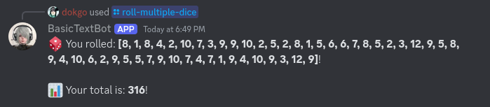

# Simple Test Discord Bot

> Add [Py Discord Bot](https://discord.com/oauth2/authorize?client_id=1330094955343122562&permissions=8&integration_type=0&scope=bot) to your server!

## Features

### Custom Embeds!

### Random Anime Generator!

### Roll Hundreds of Dice!

## Events

Every event type for the discord bot:

- on_ready()
- on_message(message)
- on_message_edit(before, after)
- on_message_delete(message)
- on_member_join(member)
- on_member_remove(member)
- on_member_update(before, after)
- on_guild_join(guild)
- on_guild_remove(guild)
- on_reaction_add(reaction, user)
- on_reaction_remove(reaction, user)

# To-Do

- [ ] Slot machine.
- [ ] Beer drink minigame.
- [ ] Fishing minigame.
- [ ] Check every command to see if it looks good.
- [ ] Random manga recommendation.
- [ ] Allow slash commands on every server.
- [ ] Make a page on your website for the discord bot and link in the projects page.

## Resources

- Video I used for learning: [link](https://youtu.be/CHbN_gB30Tw?si=SAXOYRxdHmqhPtRj);
- GitHub repo I used to find cool API's" [link](https://github.com/public-apis/public-apis?tab=readme-ov-file)
- Discord API: [DiscordPy](https://github.com/Rapptz/discord.py)
- Quotes Generator API: [pyquotegen](https://github.com/Armanidrisi/pyquotegen)
- Anime API: [Jikan](https://jikan.moe/)