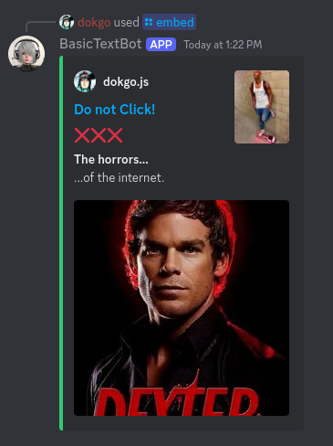
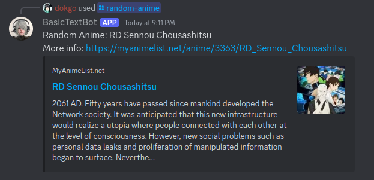

# Simple Test Discord Bot

## Features

### Embeds!

### Random Anime Generator!

## Events

Every event type for the discord bot:

- on_ready()
- on_message(message)
- on_message_edit(before, after)
- on_message_delete(message)
- on_member_join(member)
- on_member_remove(member)
- on_member_update(before, after)
- on_guild_join(guild)
- on_guild_remove(guild)
- on_reaction_add(reaction, user)
- on_reaction_remove(reaction, user)

# To-Do

- [ ] Slot machine.
- [ ] Allow slash commands on every server.

## Resources

- Video I used for learning: [link](https://youtu.be/CHbN_gB30Tw?si=SAXOYRxdHmqhPtRj);
- Discord API: [DiscordPy](https://github.com/Rapptz/discord.py)
- Quotes Generator API: [pyquotegen](https://github.com/Armanidrisi/pyquotegen)
- Anime API: [Jikan](https://jikan.moe/)